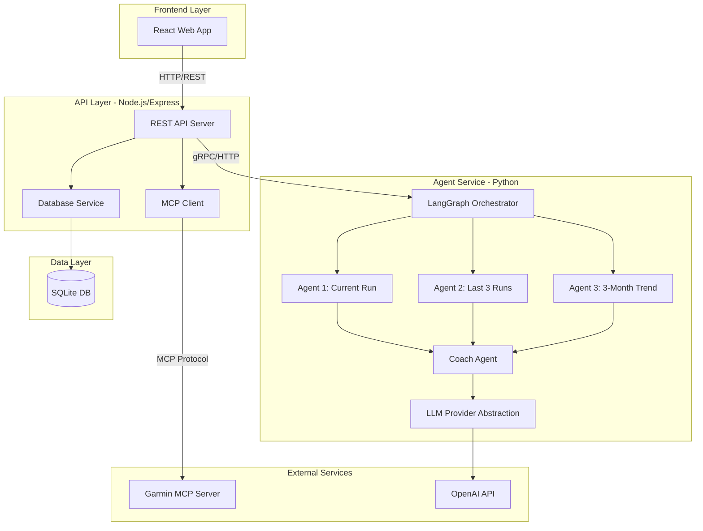

# Running Coach App - Development Plan

## Executive Summary

A modular sports coaching application that integrates with Garmin via MCP server and uses LangGraph-based multi-agent system for intelligent run analysis and personalized training plan generation.

**Tech Stack:**
- **Frontend:** React with TypeScript
- **API Layer:** Node.js with Express
- **Agent Service:** Python with LangGraph
- **Database:** SQLite (v1)
- **LLM Provider:** OpenAI API
- **Integration:** Garmin MCP Server

---

## Architecture Overview



---

## Project Structure

```
running-coach-app/
├── frontend/                    # React application
│   ├── src/
│   │   ├── components/         # Reusable UI components
│   │   ├── pages/              # Page components
│   │   ├── services/           # API client services
│   │   ├── hooks/              # Custom React hooks
│   │   ├── types/              # TypeScript type definitions
│   │   └── utils/              # Utility functions
│   ├── public/
│   ├── package.json
│   └── tsconfig.json
│
├── backend/                     # Node.js/Express API
│   ├── src/
│   │   ├── routes/             # API route handlers
│   │   ├── controllers/        # Business logic controllers
│   │   ├── services/           # Service layer
│   │   │   ├── mcp-client/    # Garmin MCP integration
│   │   │   ├── database/      # Database operations
│   │   │   └── agent-client/  # Python agent service client
│   │   ├── models/             # Data models
│   │   ├── middleware/         # Express middleware
│   │   └── utils/              # Utility functions
│   ├── tests/
│   ├── package.json
│   └── tsconfig.json
│
├── agent-service/               # Python LangGraph service
│   ├── src/
│   │   ├── agents/             # Agent implementations
│   │   │   ├── current_run_analyzer.py
│   │   │   ├── recent_runs_comparator.py
│   │   │   ├── fitness_trend_analyzer.py
│   │   │   └── coach_agent.py
│   │   ├── orchestration/      # LangGraph workflow
│   │   │   ├── graph.py
│   │   │   └── state.py
│   │   ├── llm/                # LLM provider abstraction
│   │   │   ├── base.py
│   │   │   └── openai_provider.py
│   │   ├── training_plans/     # Training plan generation
│   │   │   ├── generator.py
│   │   │   └── constraints.py
│   │   ├── schemas/            # Pydantic models
│   │   └── utils/              # Utility functions
│   ├── tests/
│   ├── requirements.txt
│   └── pyproject.toml
│
├── config/                      # Configuration files
│   ├── app.config.json         # Application configuration
│   ├── llm.config.json         # LLM API configuration
│   ├── garmin.credentials.txt  # Garmin credentials (v1)
│   ├── .env.example            # Environment variables template
│   └── README.md               # Configuration documentation
│
├── database/                    # Database files and migrations
│   ├── schema.sql              # SQLite schema
│   ├── migrations/             # Database migrations
│   └── seeds/                  # Seed data for development
│
├── docs/                        # Documentation
│   ├── api/                    # API documentation
│   ├── architecture/           # Architecture diagrams
│   ├── deployment/             # Deployment guides
│   └── user-guide/             # User documentation
│
├── scripts/                     # Utility scripts
│   ├── setup.sh                # Initial setup script
│   ├── start-dev.sh            # Development startup
│   └── migrate-db.sh           # Database migration
│
├── docker-compose.yml          # Docker composition (optional)
├── .gitignore
└── README.md
```

---

## Module Specifications

### 1. Configuration Management

**Location:** `config/`

**Files:**
- `app.config.json` - Application-wide settings
- `llm.config.json` - LLM provider configuration
- `garmin.credentials.txt` - Garmin OAuth credentials (v1)
- `.env` - Environment-specific variables

**app.config.json Structure:**
```json
{
  "app": {
    "name": "Running Coach",
    "version": "1.0.0",
    "environment": "development"
  },
  "api": {
    "port": 3000,
    "host": "localhost",
    "cors": {
      "enabled": true,
      "origins": ["http://localhost:5173"]
    }
  },
  "agentService": {
    "host": "localhost",
    "port": 5000,
    "protocol": "http"
  },
  "database": {
    "type": "sqlite",
    "path": "./database/running_coach.db"
  },
  "mcp": {
    "garmin": {
      "command": "/Users/anupk/devops/mcp/garmin_mcp/.venv/bin/python",
      "args": ["/Users/anupk/devops/mcp/garmin_mcp/garmin_mcp_server.py"],
      "timeout": 30000
    }
  },
  "security": {
    "tokenEncryption": true,
    "encryptionAlgorithm": "aes-256-gcm"
  },
  "observability": {
    "logging": {
      "level": "info",
      "format": "json"
    },
    "tracking": {
      "promptVersions": true,
      "modelVersions": true,
      "dataQuality": true
    }
  }
}
```

**llm.config.json Structure:**
```json
{
  "provider": "openai",
  "openai": {
    "apiKey": "${OPENAI_API_KEY}",
    "organization": "${OPENAI_ORG_ID}",
    "models": {
      "analyzer": "gpt-4-turbo-preview",
      "coach": "gpt-4-turbo-preview"
    },
    "parameters": {
      "temperature": 0.7,
      "maxTokens": 2000,
      "topP": 1.0
    },
    "features": {
      "structuredOutputs": true,
      "toolCalling": true,
      "streaming": true
    }
  },
  "fallback": {
    "enabled": false,
    "provider": "anthropic"
  },
  "rateLimiting": {
    "requestsPerMinute": 60,
    "tokensPerMinute": 90000
  }
}
```

**garmin.credentials.txt Structure (v1):**
```
# Garmin OAuth Credentials
# NOTE: This will be migrated to secure vault in v1.1

GARMIN_CONSUMER_KEY=your_consumer_key_here
GARMIN_CONSUMER_SECRET=your_consumer_secret_here

# OAuth Tokens (auto-updated by MCP server)
GARMIN_ACCESS_TOKEN=
GARMIN_ACCESS_TOKEN_SECRET=
GARMIN_TOKEN_EXPIRY=

# User Information
GARMIN_USER_ID=
GARMIN_USER_EMAIL=

# Migration Note:
# Future versions will use HashiCorp Vault or AWS Secrets Manager
```

---

### 2. Database Schema

**Location:** `database/schema.sql`

**Entities:**

```sql
-- Users table
CREATE TABLE users (
    id TEXT PRIMARY KEY,
    email TEXT UNIQUE NOT NULL,
    garmin_user_id TEXT UNIQUE,
    created_at TIMESTAMP DEFAULT CURRENT_TIMESTAMP,
    updated_at TIMESTAMP DEFAULT CURRENT_TIMESTAMP,
    preferences JSON
);

-- Run Activities table
CREATE TABLE run_activities (
    id TEXT PRIMARY KEY,
    user_id TEXT NOT NULL,
    garmin_activity_id TEXT UNIQUE NOT NULL,
    activity_date TIMESTAMP NOT NULL,
    distance_meters REAL,
    duration_seconds INTEGER,
    avg_pace_min_per_km REAL,
    avg_heart_rate INTEGER,
    max_heart_rate INTEGER,
    avg_cadence INTEGER,
    avg_power REAL,
    elevation_gain_meters REAL,
    run_type TEXT,
    raw_data JSON,
    created_at TIMESTAMP DEFAULT CURRENT_TIMESTAMP,
    FOREIGN KEY (user_id) REFERENCES users(id)
);

-- Fitness Metric Snapshots table
CREATE TABLE fitness_metric_snapshots (
    id TEXT PRIMARY KEY,
    user_id TEXT NOT NULL,
    snapshot_date TIMESTAMP NOT NULL,
    vo2_max REAL,
    training_load REAL,
    recovery_time_hours INTEGER,
    fitness_age INTEGER,
    raw_metrics JSON,
    created_at TIMESTAMP DEFAULT CURRENT_TIMESTAMP,
    FOREIGN KEY (user_id) REFERENCES users(id)
);

-- Analysis Reports table
CREATE TABLE analysis_reports (
    id TEXT PRIMARY KEY,
    user_id TEXT NOT NULL,
    report_type TEXT NOT NULL,
    activity_id TEXT,
    analysis_date TIMESTAMP NOT NULL,
    agent_outputs JSON NOT NULL,
    coaching_narrative TEXT,
    key_insights JSON,
    version TEXT NOT NULL,
    created_at TIMESTAMP DEFAULT CURRENT_TIMESTAMP,
    FOREIGN KEY (user_id) REFERENCES users(id),
    FOREIGN KEY (activity_id) REFERENCES run_activities(id)
);

-- Training Plans table
CREATE TABLE training_plans (
    id TEXT PRIMARY KEY,
    user_id TEXT NOT NULL,
    plan_type TEXT NOT NULL,
    goal_distance TEXT NOT NULL,
    goal_date DATE,
    start_date DATE NOT NULL,
    end_date DATE NOT NULL,
    phases JSON NOT NULL,
    weekly_structure JSON NOT NULL,
    safety_constraints JSON NOT NULL,
    status TEXT DEFAULT 'active',
    version TEXT NOT NULL,
    created_at TIMESTAMP DEFAULT CURRENT_TIMESTAMP,
    updated_at TIMESTAMP DEFAULT CURRENT_TIMESTAMP,
    FOREIGN KEY (user_id) REFERENCES users(id)
);

-- Agent Execution Logs table (Observability)
CREATE TABLE agent_execution_logs (
    id TEXT PRIMARY KEY,
    report_id TEXT,
    agent_name TEXT NOT NULL,
    execution_start TIMESTAMP NOT NULL,
    execution_end TIMESTAMP,
    status TEXT NOT NULL,
    input_data JSON,
    output_data JSON,
    error_message TEXT,
    prompt_version TEXT,
    model_version TEXT,
    token_usage JSON,
    created_at TIMESTAMP DEFAULT CURRENT_TIMESTAMP,
    FOREIGN KEY (report_id) REFERENCES analysis_reports(id)
);

-- Indexes for performance
CREATE INDEX idx_run_activities_user_date ON run_activities(user_id, activity_date DESC);
CREATE INDEX idx_fitness_snapshots_user_date ON fitness_metric_snapshots(user_id, snapshot_date DESC);
CREATE INDEX idx_analysis_reports_user_date ON analysis_reports(user_id, analysis_date DESC);
CREATE INDEX idx_training_plans_user_status ON training_plans(user_id, status);
CREATE INDEX idx_agent_logs_report ON agent_execution_logs(report_id);
```

---

### 3. Backend API (Node.js/Express)

**Location:** `backend/src/`

**Key Modules:**

#### 3.1 API Routes
```typescript
// routes/api.routes.ts
- POST   /api/auth/login
- POST   /api/auth/logout
- GET    /api/user/profile
- GET    /api/activities
- GET    /api/activities/:id
- POST   /api/activities/sync
- POST   /api/analysis/run
- GET    /api/analysis/:id
- GET    /api/training-plans
- POST   /api/training-plans/generate
- GET    /api/training-plans/:id
- PUT    /api/training-plans/:id
```

#### 3.2 MCP Client Service
```typescript
// services/mcp-client/garmin-client.ts
class GarminMCPClient {
  - connect(): Promise<void>
  - disconnect(): Promise<void>
  - getActivities(startDate, endDate): Promise<Activity[]>
  - getActivity(activityId): Promise<Activity>
  - getFitnessMetrics(): Promise<FitnessMetrics>
  - syncLatestActivities(): Promise<Activity[]>
}
```

#### 3.3 Agent Service Client
```typescript
// services/agent-client/agent-service-client.ts
class AgentServiceClient {
  - analyzeRun(activityData, context): Promise<AnalysisReport>
  - generateTrainingPlan(userProfile, goal): Promise<TrainingPlan>
  - getAgentStatus(): Promise<ServiceStatus>
}
```

---

### 4. Agent Service (Python/LangGraph)

**Location:** `agent-service/src/`

**Key Components:**

#### 4.1 LangGraph Orchestration
```python
# orchestration/graph.py
class CoachingWorkflow:
    - build_graph(): StateGraph
    - execute(input_data): AnalysisResult
    
# State definition
class WorkflowState(TypedDict):
    current_run_data: RunActivity
    recent_runs_data: List[RunActivity]
    fitness_trend_data: FitnessMetrics
    agent1_output: CurrentRunAnalysis
    agent2_output: RecentRunsComparison
    agent3_output: FitnessTrendAnalysis
    coach_output: CoachingReport
```

#### 4.2 Agent Implementations

**Agent 1: Current Run Analyzer**
```python
# agents/current_run_analyzer.py
class CurrentRunAnalyzer:
    - classify_run_type(activity): RunType
    - analyze_pacing(activity): PacingAnalysis
    - analyze_heart_rate(activity): HRAnalysis
    - analyze_cadence_power(activity): BiomechanicsAnalysis
    - execute(state): CurrentRunAnalysis
```

**Agent 2: Recent Runs Comparator**
```python
# agents/recent_runs_comparator.py
class RecentRunsComparator:
    - compare_efficiency(runs): EfficiencyTrend
    - detect_consistency(runs): ConsistencyMetrics
    - identify_risk_flags(runs): List[RiskFlag]
    - execute(state): RecentRunsComparison
```

**Agent 3: Fitness Trend Analyzer**
```python
# agents/fitness_trend_analyzer.py
class FitnessTrendAnalyzer:
    - analyze_vo2max_trend(metrics): VO2MaxTrend
    - analyze_load_recovery(metrics): LoadRecoveryAnalysis
    - assess_readiness(metrics): ReadinessScore
    - execute(state): FitnessTrendAnalysis
```

**Coach Agent**
```python
# agents/coach_agent.py
class CoachAgent:
    - synthesize_insights(agent_outputs): CoachingInsights
    - generate_narrative(insights): str
    - generate_training_plans(profile, insights): List[TrainingPlan]
    - execute(state): CoachingReport
```

#### 4.3 LLM Provider Abstraction
```python
# llm/base.py
class LLMProvider(ABC):
    @abstractmethod
    def generate(prompt, schema): Response
    
    @abstractmethod
    def generate_stream(prompt): Iterator[str]

# llm/openai_provider.py
class OpenAIProvider(LLMProvider):
    - generate(prompt, schema): Response
    - generate_stream(prompt): Iterator[str]
    - _handle_rate_limit(): void
```

#### 4.4 Training Plan Generator
```python
# training_plans/generator.py
class TrainingPlanGenerator:
    - generate_10k_plan(profile, insights): TrainingPlan
    - generate_half_marathon_plan(profile, insights): TrainingPlan
    - generate_marathon_plan(profile, insights): TrainingPlan
    - apply_safety_constraints(plan): TrainingPlan
    
# training_plans/constraints.py
class SafetyConstraints:
    MAX_HARD_SESSIONS_PER_WEEK = 2
    MAX_VOLUME_INCREASE_PERCENT = 12
    MAX_LONG_RUN_PERCENT = 35
```

---

### 5. Frontend (React)

**Location:** `frontend/src/`

**Key Pages:**
- Dashboard - Overview of recent runs and fitness trends
- Run Analysis - Detailed analysis of individual runs
- Training Plans - View and manage training plans
- Settings - User preferences and Garmin connection

**Key Components:**
- RunCard - Display run summary
- MetricsChart - Visualize fitness metrics
- TrainingCalendar - Weekly training schedule
- CoachingNarrative - Display AI-generated insights

---

## Development Phases

### Phase 1: Foundation (Weeks 1-2)
- Set up project structure
- Create configuration system
- Initialize database schema
- Set up development environment

### Phase 2: Backend Core (Weeks 3-4)
- Implement Node.js API server
- Build MCP client integration
- Create database service layer
- Implement basic CRUD operations

### Phase 3: Agent Service (Weeks 5-7)
- Build LangGraph orchestration
- Implement all 4 agents
- Create LLM provider abstraction
- Implement training plan generator

### Phase 4: Frontend (Weeks 8-9)
- Build React application
- Implement dashboard and analysis views
- Create training plan interface
- Add data visualization

### Phase 5: Integration & Testing (Weeks 10-11)
- End-to-end integration testing
- Agent workflow testing
- Performance optimization
- Security hardening

### Phase 6: Observability & Documentation (Week 12)
- Implement logging and monitoring
- Create API documentation
- Write user guides
- Deployment preparation

---

## Security Considerations

### v1 Implementation:
1. **Garmin Credentials:** Plain text file with restricted permissions (chmod 600)
2. **API Keys:** Environment variables
3. **Token Storage:** Encrypted in database using AES-256-GCM
4. **HTTPS:** Required for production

### v1.1 Migration Plan:
- Migrate to HashiCorp Vault or AWS Secrets Manager
- Implement automatic credential rotation
- Add audit logging for credential access

---

## Observability Strategy

### Logging:
- Structured JSON logs
- Log levels: DEBUG, INFO, WARN, ERROR
- Correlation IDs for request tracing

### Tracking:
- Agent execution metrics
- Prompt and model versions
- Token usage and costs
- Data quality flags

### Monitoring:
- API response times
- Agent execution duration
- Database query performance
- MCP server health

---

## Testing Strategy

### Unit Tests:
- Agent logic
- Training plan generation
- Data model validation

### Integration Tests:
- API endpoints
- MCP client communication
- Agent workflow execution
- Database operations

### End-to-End Tests:
- Complete user workflows
- Multi-agent orchestration
- Training plan generation

---

## Deployment

### Development:
```bash
# Start all services
./scripts/start-dev.sh

# Services:
# - Frontend: http://localhost:5173
# - Backend API: http://localhost:3000
# - Agent Service: http://localhost:5000
```

### Production:
- Docker containers for each service
- Nginx reverse proxy
- SQLite database with regular backups
- Environment-based configuration

---

## Next Steps

1. Review and approve this development plan
2. Set up initial project structure
3. Create configuration files
4. Initialize database schema
5. Begin Phase 1 implementation

---

## Notes

- **Modularity:** Each service is independently deployable
- **Scalability:** Can migrate to PostgreSQL and microservices architecture
- **Extensibility:** LLM provider abstraction allows easy provider switching
- **Security:** Credential management designed for vault migration
- **Observability:** Built-in logging and tracking from day one