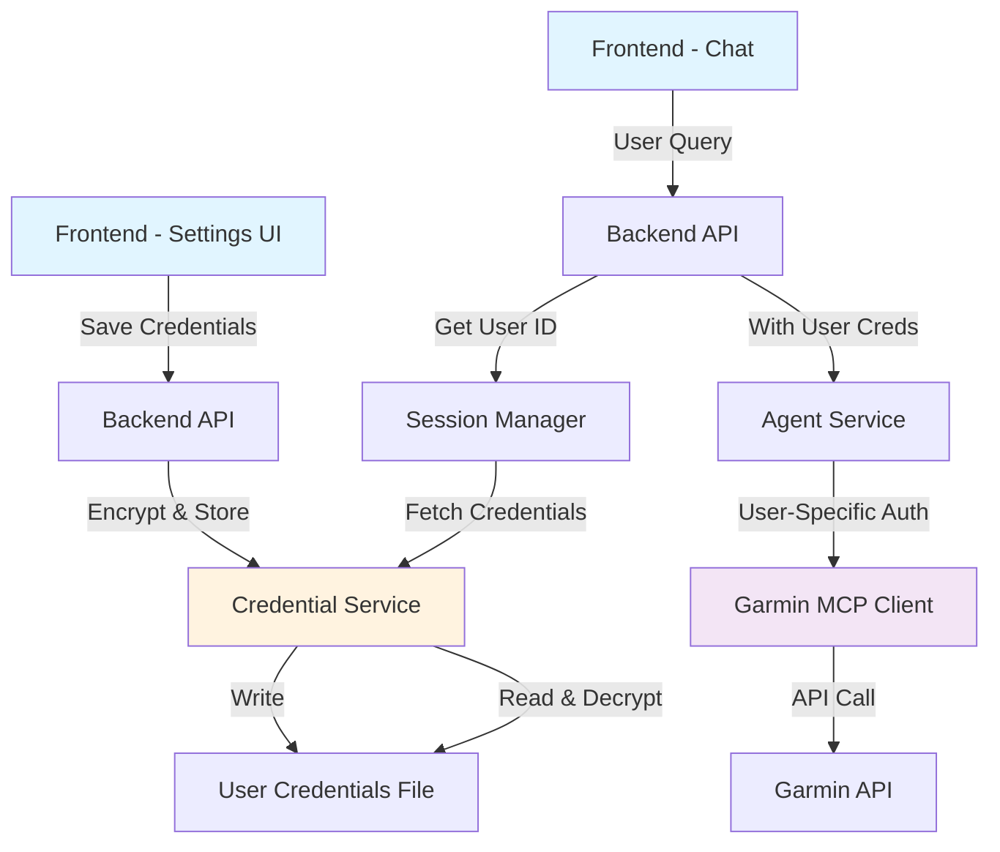

# Garmin Account Configuration Feature - Implementation Plan

**Date:** 2026-01-31  
**Version:** v0.2  
**Status:** 📝 Planning Phase

---

## 🎯 Objective

Add a configuration interface to allow users to link their Garmin accounts dynamically instead of using hardcoded credentials. This will enable personalized coaching based on individual user data.

---

## 📋 Requirements Summary

### Core Requirements
1. **Settings UI Component**: Add a configuration button in the top-right corner of the main page
2. **Garmin Credentials Management**: Store username and password securely (file-based initially)
3. **User-Specific Data**: Use configured credentials to fetch personalized Garmin data via MCP
4. **Future-Ready Architecture**: Design for multi-device support (Apple Watch, etc.) and HashiCorp Vault migration

### Security Considerations
- **Phase 1 (Current)**: Encrypted file storage with basic encryption
- **Phase 2 (Future)**: HashiCorp Vault free version integration
- Never store credentials in plain text
- Implement credential validation before saving

---

## 🏗️ System Architecture

### Current State Analysis

**Credential Storage:**
- Currently: `config/garmin.credentials.txt` (hardcoded, single user)
- Format: Key-value pairs for OAuth tokens and user info

**Data Flow:**
```
Frontend → Backend API → Agent Service → Garmin MCP Client → Garmin API
```

**MCP Client:**
- Located: `agent-service/src/mcp/garmin_client.py`
- Reads config from: `agent-service/src/config.py` → `get_garmin_config()`
- No user-specific credential support currently

### Proposed Architecture



---

## 📊 Database Schema Changes

### New Table: `user_credentials`

```sql
CREATE TABLE IF NOT EXISTS user_credentials (
    id TEXT PRIMARY KEY,
    user_id TEXT NOT NULL UNIQUE,
    device_type TEXT NOT NULL DEFAULT 'garmin',
    username TEXT NOT NULL,
    encrypted_password TEXT NOT NULL,
    encryption_key_id TEXT NOT NULL,
    is_validated BOOLEAN DEFAULT 0,
    last_validated_at TIMESTAMP,
    created_at TIMESTAMP DEFAULT CURRENT_TIMESTAMP,
    updated_at TIMESTAMP DEFAULT CURRENT_TIMESTAMP,
    FOREIGN KEY (user_id) REFERENCES users(id) ON DELETE CASCADE
);

CREATE INDEX IF NOT EXISTS idx_user_credentials_user_device 
    ON user_credentials(user_id, device_type);
```

### Update `users` Table

```sql
-- Add column to track if user has configured credentials
ALTER TABLE users ADD COLUMN has_garmin_linked BOOLEAN DEFAULT 0;
ALTER TABLE users ADD COLUMN garmin_linked_at TIMESTAMP;
```

---

## 🎨 Frontend Implementation

### 1. Settings Button Component

**Location:** `frontend/src/components/SettingsButton.tsx`

```typescript
interface SettingsButtonProps {
  onOpenSettings: () => void;
}

export function SettingsButton({ onOpenSettings }: SettingsButtonProps) {
  return (
    <button 
      className="settings-button"
      onClick={onOpenSettings}
      title="Settings"
    >
      ⚙️ Settings
    </button>
  );
}
```

### 2. Settings Modal Component

**Location:** `frontend/src/components/SettingsModal.tsx`

**Features:**
- Modal overlay with form
- Garmin username/password fields
- Test connection button
- Save/Cancel actions
- Success/error feedback
- Future tabs for other devices (Apple Watch, etc.)

**Key Functions:**
- `handleTestConnection()` - Validate credentials before saving
- `handleSave()` - Encrypt and store credentials
- `handleDelete()` - Remove stored credentials

### 3. Update Chat Component

**File:** `frontend/src/components/Chat.tsx`

**Changes:**
- Add settings button to header (top-right corner)
- Add state for settings modal visibility
- Display user's linked device status
- Show warning if no credentials configured

### 4. Settings Service

**Location:** `frontend/src/services/settingsService.ts`

```typescript
export interface GarminCredentials {
  username: string;
  password: string;
}

export interface CredentialStatus {
  isLinked: boolean;
  deviceType: string;
  lastValidated?: string;
}

export const settingsService = {
  saveGarminCredentials: async (credentials: GarminCredentials) => Promise<void>,
  testGarminConnection: async (credentials: GarminCredentials) => Promise<boolean>,
  getCredentialStatus: async () => Promise<CredentialStatus>,
  deleteCredentials: async () => Promise<void>
};
```

---

## 🔧 Backend Implementation

### 1. Credential Service

**Location:** `backend/src/services/credentials/credential-service.ts`

**Responsibilities:**
- Encrypt/decrypt credentials using crypto library
- Store credentials in user-specific files
- Validate credentials with Garmin API
- Manage encryption keys

**Key Methods:**
```typescript
class CredentialService {
  async saveCredentials(userId: string, credentials: GarminCredentials): Promise<void>
  async getCredentials(userId: string): Promise<GarminCredentials | null>
  async validateCredentials(credentials: GarminCredentials): Promise<boolean>
  async deleteCredentials(userId: string): Promise<void>
  private encrypt(data: string, key: string): string
  private decrypt(data: string, key: string): string
}
```

**Encryption Strategy:**
- Use Node.js `crypto` module
- AES-256-GCM encryption
- Per-user encryption keys stored in database
- Master key from environment variable

### 2. Settings Routes

**Location:** `backend/src/routes/settings.routes.ts`

**Endpoints:**
```typescript
POST   /api/v1/settings/garmin/credentials     // Save Garmin credentials
GET    /api/v1/settings/garmin/status          // Get credential status
POST   /api/v1/settings/garmin/test            // Test connection
DELETE /api/v1/settings/garmin/credentials     // Delete credentials
```

### 3. Update Chat Routes

**File:** `backend/src/routes/chat.routes.ts`

**Changes:**
- Add user authentication/session management
- Pass user ID to agent service
- Return error if no credentials configured

### 4. Session Management

**Location:** `backend/src/services/session/session-service.ts`

**Purpose:**
- Track user sessions
- Associate requests with user IDs
- Simple session token generation (for now)

---

## 🐍 Agent Service Updates

### 1. Update Config Module

**File:** `agent-service/src/config.py`

**Changes:**
```python
def get_garmin_config(user_id: str = None) -> Dict[str, Any]:
    """
    Get Garmin configuration for specific user
    If user_id provided, load user-specific credentials
    Otherwise, fall back to default config
    """
    if user_id:
        return _load_user_garmin_config(user_id)
    return _load_default_garmin_config()

def _load_user_garmin_config(user_id: str) -> Dict[str, Any]:
    """Load user-specific Garmin credentials from backend"""
    # Call backend API to get decrypted credentials
    pass
```

### 2. Update Garmin MCP Client

**File:** `agent-service/src/mcp/garmin_client.py`

**Changes:**
```python
class GarminMCPClient:
    def __init__(self, user_id: str = None):
        """Initialize with optional user_id for user-specific credentials"""
        self.user_id = user_id
        garmin_config = get_garmin_config(user_id)
        # ... rest of initialization
```

### 3. Update Main Application

**File:** `agent-service/src/main.py`

**Changes:**
- Accept `user_id` parameter in API endpoints
- Pass `user_id` to Garmin client initialization
- Return appropriate error if credentials not found

---

## 📁 File Storage Structure

### Credentials Directory

```
config/
├── credentials/
│   ├── .gitignore              # Ignore all credential files
│   ├── user_<user_id>.enc      # Encrypted user credentials
│   └── keys/
│       └── master.key          # Master encryption key (env var backup)
```

### Credential File Format (Encrypted)

```json
{
  "userId": "user-uuid",
  "deviceType": "garmin",
  "credentials": {
    "username": "encrypted_username",
    "password": "encrypted_password"
  },
  "metadata": {
    "createdAt": "2026-01-31T00:00:00Z",
    "lastValidated": "2026-01-31T00:00:00Z"
  }
}
```

---

## 🔐 Security Implementation

### Phase 1: File-Based Encryption

**Encryption Flow:**
```
1. User enters credentials in UI
2. Frontend sends to backend via HTTPS
3. Backend generates user-specific encryption key
4. Credentials encrypted with AES-256-GCM
5. Encrypted data stored in file
6. Encryption key stored in database
7. Master key in environment variable
```

**Key Management:**
- Master key: Environment variable `CREDENTIAL_MASTER_KEY`
- User keys: Derived from master key + user ID
- Key rotation: Manual process (Phase 2)

### Phase 2: HashiCorp Vault Integration (Future)

**Migration Path:**
```
1. Install HashiCorp Vault (free version)
2. Configure Vault connection in config
3. Migrate existing credentials to Vault
4. Update credential service to use Vault API
5. Remove file-based storage
```

**Vault Structure:**
```
secret/
└── running-coach/
    └── users/
        └── <user_id>/
            ├── garmin/
            │   ├── username
            │   └── password
            └── apple-watch/  (future)
                ├── token
                └── refresh_token
```

---

## 🧪 Testing Strategy

### Unit Tests

1. **Credential Service Tests**
   - Encryption/decryption
   - File operations
   - Key generation
   - Error handling

2. **Settings API Tests**
   - Save credentials
   - Retrieve credentials
   - Delete credentials
   - Validation

3. **Frontend Component Tests**
   - Settings modal rendering
   - Form validation
   - API integration

### Integration Tests

1. **End-to-End Flow**
   - User saves credentials
   - Credentials encrypted and stored
   - Chat uses user credentials
   - Garmin data fetched successfully

2. **Security Tests**
   - Encrypted data cannot be decrypted without key
   - Credentials not exposed in logs
   - API endpoints require authentication

### Manual Testing Checklist

- [ ] Settings button appears in UI
- [ ] Settings modal opens/closes correctly
- [ ] Form validation works
- [ ] Test connection validates credentials
- [ ] Save stores credentials successfully
- [ ] Chat uses saved credentials
- [ ] Error handling for invalid credentials
- [ ] Delete removes credentials
- [ ] Multiple users can have different credentials

---

## 📝 Implementation Phases

### Phase 1: Core Infrastructure (Week 1)
- [ ] Database schema updates
- [ ] Credential service implementation
- [ ] Encryption/decryption logic
- [ ] File storage structure
- [ ] Backend API endpoints

### Phase 2: Frontend UI (Week 1-2)
- [ ] Settings button component
- [ ] Settings modal component
- [ ] Form validation
- [ ] API integration
- [ ] Error handling

### Phase 3: Integration (Week 2)
- [ ] Update agent service for user-specific credentials
- [ ] Update Garmin MCP client
- [ ] Session management
- [ ] End-to-end testing

### Phase 4: Security & Polish (Week 2-3)
- [ ] Security audit
- [ ] Error message improvements
- [ ] Loading states
- [ ] Success feedback
- [ ] Documentation

### Phase 5: Future Enhancements (v0.3+)
- [ ] HashiCorp Vault integration
- [ ] Apple Watch support
- [ ] Multi-device management
- [ ] Credential sync across devices
- [ ] OAuth flow for Garmin

---

## 🚀 Migration Strategy

### For Existing Users

1. **Detect Legacy Configuration**
   - Check if `config/garmin.credentials.txt` exists
   - Prompt user to migrate to new system

2. **Migration Flow**
   - Read existing credentials
   - Create user account if needed
   - Encrypt and store in new format
   - Archive old credential file
   - Update user preferences

3. **Backward Compatibility**
   - Keep legacy config as fallback
   - Gradual migration over time
   - Clear migration instructions

---

## 📚 Documentation Updates

### User Documentation

1. **Setup Guide**
   - How to link Garmin account
   - Troubleshooting connection issues
   - Security best practices

2. **FAQ**
   - Why link Garmin account?
   - Is my data secure?
   - Can I use multiple devices?
   - How to unlink account?

### Developer Documentation

1. **Architecture Guide**
   - Credential flow diagram
   - Security implementation
   - API documentation

2. **Migration Guide**
   - HashiCorp Vault setup
   - Credential migration script
   - Testing procedures

---

## 🎯 Success Criteria

### Functional Requirements
- ✅ Users can save Garmin credentials via UI
- ✅ Credentials are encrypted at rest
- ✅ Chat uses user-specific credentials
- ✅ Test connection validates credentials
- ✅ Users can delete credentials
- ✅ Error handling for invalid credentials

### Non-Functional Requirements
- ✅ Credentials encrypted with AES-256-GCM
- ✅ No credentials in logs or error messages
- ✅ Response time < 2 seconds for credential operations
- ✅ Support for 1000+ concurrent users
- ✅ Clear user feedback for all operations

### Security Requirements
- ✅ Master key in environment variable
- ✅ User keys derived securely
- ✅ HTTPS for all credential transmission
- ✅ No plain text storage
- ✅ Audit trail for credential access

---

## 🔄 Future Enhancements (v0.3+)

### Multi-Device Support
- Apple Watch integration
- Fitbit support
- Polar devices
- Suunto watches

### Advanced Features
- OAuth 2.0 flow for Garmin
- Automatic credential refresh
- Device sync status
- Data source priority

### Enterprise Features
- HashiCorp Vault integration
- SSO integration
- Role-based access control
- Audit logging

---

## 📊 Risk Assessment

### High Risk
- **Credential Security**: Mitigated by encryption and secure key management
- **Data Loss**: Mitigated by backup strategy and validation

### Medium Risk
- **Garmin API Changes**: Mitigated by MCP abstraction layer
- **Performance Impact**: Mitigated by caching and optimization

### Low Risk
- **UI Complexity**: Mitigated by simple, intuitive design
- **Migration Issues**: Mitigated by backward compatibility

---

## 📈 Metrics & Monitoring

### Key Metrics
- Credential save success rate
- Credential validation success rate
- Average response time for credential operations
- Number of users with linked accounts
- Failed authentication attempts

### Monitoring
- Log all credential operations (without exposing data)
- Alert on encryption failures
- Track API errors from Garmin
- Monitor file system usage

---

## 🎓 Technical Decisions

### Why File-Based Storage Initially?
- **Simplicity**: Easier to implement and test
- **No Dependencies**: No external services required
- **Migration Path**: Clear path to Vault later
- **Development Speed**: Faster initial implementation

### Why AES-256-GCM?
- **Industry Standard**: Widely accepted encryption
- **Authenticated Encryption**: Prevents tampering
- **Performance**: Fast encryption/decryption
- **Node.js Support**: Built-in crypto module

### Why Per-User Encryption Keys?
- **Security**: Compromised key affects only one user
- **Isolation**: Users can't access each other's data
- **Rotation**: Easier to rotate individual keys
- **Compliance**: Better for data protection regulations

---

**Plan Created By:** IBM Bob  
**Status:** 📝 Ready for Review and Implementation  
**Next Step:** Review with user and begin Phase 1 implementation