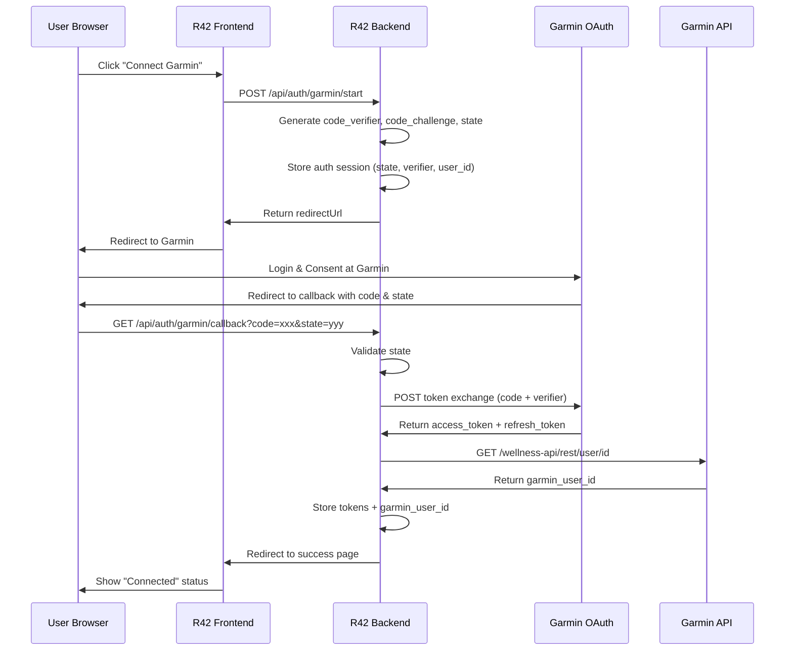

# Garmin OAuth2 PKCE Implementation Plan - R42 Running Coach

**Date:** 2026-01-31  
**Version:** v0.2  
**Status:** 📝 Ready for Implementation

---

## 🎯 Objective

Implement Garmin Connect OAuth2 with PKCE (Proof Key for Code Exchange) authentication flow to allow users to securely link their Garmin accounts without ever providing their username/password to R42.

**Key Principle:** Never collect Garmin credentials - use OAuth2 redirect flow where Garmin handles authentication.

---

## 📋 Requirements Summary

### Core Requirements
1. **OAuth2 PKCE Flow**: Implement full authorization code flow with PKCE
2. **Token Management**: Securely store and refresh access/refresh tokens
3. **User Linking**: Associate Garmin User ID with R42 users
4. **Settings UI**: "Connect Garmin" button that initiates OAuth flow
5. **Token Refresh**: Automatic token refresh before expiry
6. **Disconnect**: Allow users to revoke Garmin connection

### Security Requirements
- Never store Garmin passwords
- PKCE verifier generated server-side only
- Tokens encrypted at rest
- State parameter validation to prevent CSRF
- Secure token rotation on refresh

---

## 🏗️ OAuth2 PKCE Flow Architecture



---

## 📊 Database Schema Updates

### New Table: `garmin_oauth_sessions`

```sql
-- Temporary auth sessions for OAuth flow (TTL: 15 minutes)
CREATE TABLE IF NOT EXISTS garmin_oauth_sessions (
    id TEXT PRIMARY KEY,
    state TEXT UNIQUE NOT NULL,
    r42_user_id TEXT NOT NULL,
    code_verifier TEXT NOT NULL,
    code_challenge TEXT NOT NULL,
    redirect_uri TEXT NOT NULL,
    created_at TIMESTAMP DEFAULT CURRENT_TIMESTAMP,
    expires_at TIMESTAMP NOT NULL,
    used BOOLEAN DEFAULT 0,
    FOREIGN KEY (r42_user_id) REFERENCES users(id) ON DELETE CASCADE
);

CREATE INDEX IF NOT EXISTS idx_oauth_sessions_state 
    ON garmin_oauth_sessions(state);
CREATE INDEX IF NOT EXISTS idx_oauth_sessions_expires 
    ON garmin_oauth_sessions(expires_at);
```

### New Table: `garmin_tokens`

```sql
-- Persistent token storage
CREATE TABLE IF NOT EXISTS garmin_tokens (
    id TEXT PRIMARY KEY,
    r42_user_id TEXT UNIQUE NOT NULL,
    garmin_user_id TEXT UNIQUE,
    
    -- Encrypted tokens
    access_token_encrypted TEXT NOT NULL,
    refresh_token_encrypted TEXT NOT NULL,
    
    -- Token metadata
    access_token_expires_at TIMESTAMP NOT NULL,
    refresh_token_expires_at TIMESTAMP NOT NULL,
    scope TEXT,
    
    -- Encryption metadata
    encryption_key_id TEXT NOT NULL,
    
    -- Audit fields
    last_refreshed_at TIMESTAMP,
    last_sync_at TIMESTAMP,
    last_error TEXT,
    
    created_at TIMESTAMP DEFAULT CURRENT_TIMESTAMP,
    updated_at TIMESTAMP DEFAULT CURRENT_TIMESTAMP,
    
    FOREIGN KEY (r42_user_id) REFERENCES users(id) ON DELETE CASCADE
);

CREATE INDEX IF NOT EXISTS idx_garmin_tokens_user 
    ON garmin_tokens(r42_user_id);
CREATE INDEX IF NOT EXISTS idx_garmin_tokens_garmin_user 
    ON garmin_tokens(garmin_user_id);
CREATE INDEX IF NOT EXISTS idx_garmin_tokens_access_expiry 
    ON garmin_tokens(access_token_expires_at);
```

### Update `users` Table

```sql
ALTER TABLE users ADD COLUMN garmin_connected BOOLEAN DEFAULT 0;
ALTER TABLE users ADD COLUMN garmin_connected_at TIMESTAMP;
ALTER TABLE users ADD COLUMN garmin_last_sync_at TIMESTAMP;
```

---

## 🎨 Frontend Implementation

### 1. Connect Garmin Button Component

**Location:** `frontend/src/components/ConnectGarminButton.tsx`

```typescript
interface ConnectGarminButtonProps {
  isConnected: boolean;
  onConnect: () => void;
  onDisconnect: () => void;
}

export function ConnectGarminButton({ 
  isConnected, 
  onConnect, 
  onDisconnect 
}: ConnectGarminButtonProps) {
  return (
    <div className="garmin-connection">
      {isConnected ? (
        <>
          <span className="status-badge connected">
            ✓ Garmin Connected
          </span>
          <button onClick={onDisconnect} className="btn-disconnect">
            Disconnect
          </button>
        </>
      ) : (
        <button onClick={onConnect} className="btn-connect">
          🔗 Connect Garmin Account
        </button>
      )}
    </div>
  );
}
```

### 2. OAuth Callback Handler

**Location:** `frontend/src/pages/GarminCallback.tsx`

```typescript
export function GarminCallback() {
  const [status, setStatus] = useState<'processing' | 'success' | 'error'>('processing');
  const navigate = useNavigate();

  useEffect(() => {
    const params = new URLSearchParams(window.location.search);
    const code = params.get('code');
    const state = params.get('state');
    const error = params.get('error');

    if (error) {
      setStatus('error');
      return;
    }

    if (code && state) {
      // Backend will handle the token exchange
      fetch(`/api/auth/garmin/callback?code=${code}&state=${state}`)
        .then(res => res.json())
        .then(data => {
          if (data.success) {
            setStatus('success');
            setTimeout(() => navigate('/'), 2000);
          } else {
            setStatus('error');
          }
        })
        .catch(() => setStatus('error'));
    }
  }, [navigate]);

  return (
    <div className="oauth-callback">
      {status === 'processing' && <p>Connecting to Garmin...</p>}
      {status === 'success' && <p>✓ Successfully connected!</p>}
      {status === 'error' && <p>✗ Connection failed. Please try again.</p>}
    </div>
  );
}
```

### 3. Garmin Service

**Location:** `frontend/src/services/garminService.ts`

```typescript
export interface GarminConnectionStatus {
  connected: boolean;
  garminUserId?: string;
  lastSync?: string;
  scope?: string;
}

export const garminService = {
  async startOAuthFlow(): Promise<{ redirectUrl: string }> {
    const response = await fetch('/api/auth/garmin/start', {
      method: 'POST',
      credentials: 'include'
    });
    return response.json();
  },

  async getConnectionStatus(): Promise<GarminConnectionStatus> {
    const response = await fetch('/api/garmin/status', {
      credentials: 'include'
    });
    return response.json();
  },

  async disconnect(): Promise<void> {
    await fetch('/api/auth/garmin/disconnect', {
      method: 'POST',
      credentials: 'include'
    });
  },

  async syncData(): Promise<void> {
    await fetch('/api/garmin/sync', {
      method: 'POST',
      credentials: 'include'
    });
  }
};
```

### 4. Update Chat Component

**File:** `frontend/src/components/Chat.tsx`

Add Garmin connection status display and connect button in header.

---

## 🔧 Backend Implementation

### 1. Garmin OAuth Service

**Location:** `backend/src/services/garmin/garmin-oauth-service.ts`

```typescript
import crypto from 'crypto';
import { databaseService } from '../database/database-service.js';
import { logger } from '../../utils/logger.js';

export class GarminOAuthService {
  private clientId: string;
  private clientSecret: string;
  private redirectUri: string;

  constructor() {
    this.clientId = process.env.GARMIN_CLIENT_ID!;
    this.clientSecret = process.env.GARMIN_CLIENT_SECRET!;
    this.redirectUri = process.env.GARMIN_REDIRECT_URI!;
  }

  /**
   * Generate PKCE code verifier (43-128 chars, A-Z a-z 0-9 - . _ ~)
   */
  private generateCodeVerifier(): string {
    return crypto.randomBytes(32)
      .toString('base64url')
      .slice(0, 128);
  }

  /**
   * Generate PKCE code challenge from verifier
   */
  private generateCodeChallenge(verifier: string): string {
    return crypto.createHash('sha256')
      .update(verifier)
      .digest('base64url');
  }

  /**
   * Generate random state parameter
   */
  private generateState(): string {
    return crypto.randomBytes(32).toString('hex');
  }

  /**
   * Start OAuth flow - returns authorization URL
   */
  async startOAuthFlow(userId: string): Promise<string> {
    const codeVerifier = this.generateCodeVerifier();
    const codeChallenge = this.generateCodeChallenge(codeVerifier);
    const state = this.generateState();

    // Store auth session (expires in 15 minutes)
    const sessionId = crypto.randomUUID();
    const expiresAt = new Date(Date.now() + 15 * 60 * 1000);

    databaseService.run(
      `INSERT INTO garmin_oauth_sessions 
       (id, state, r42_user_id, code_verifier, code_challenge, redirect_uri, expires_at)
       VALUES (?, ?, ?, ?, ?, ?, ?)`,
      [sessionId, state, userId, codeVerifier, codeChallenge, this.redirectUri, expiresAt.toISOString()]
    );

    // Build authorization URL
    const authUrl = new URL('https://connect.garmin.com/oauth2Confirm');
    authUrl.searchParams.set('response_type', 'code');
    authUrl.searchParams.set('client_id', this.clientId);
    authUrl.searchParams.set('code_challenge', codeChallenge);
    authUrl.searchParams.set('code_challenge_method', 'S256');
    authUrl.searchParams.set('redirect_uri', this.redirectUri);
    authUrl.searchParams.set('state', state);

    logger.info('OAuth flow started', { userId, state });
    return authUrl.toString();
  }

  /**
   * Handle OAuth callback - exchange code for tokens
   */
  async handleCallback(code: string, state: string): Promise<{ userId: string; success: boolean }> {
    // Validate state and get session
    const session = databaseService.get<any>(
      `SELECT * FROM garmin_oauth_sessions WHERE state = ? AND used = 0`,
      [state]
    );

    if (!session) {
      throw new Error('Invalid or expired state');
    }

    if (new Date(session.expires_at) < new Date()) {
      throw new Error('Auth session expired');
    }

    // Mark session as used
    databaseService.run(
      `UPDATE garmin_oauth_sessions SET used = 1 WHERE id = ?`,
      [session.id]
    );

    // Exchange code for tokens
    const tokenResponse = await this.exchangeCodeForTokens(
      code,
      session.code_verifier,
      session.redirect_uri
    );

    // Fetch Garmin user ID
    const garminUserId = await this.fetchGarminUserId(tokenResponse.access_token);

    // Store tokens
    await this.storeTokens(
      session.r42_user_id,
      garminUserId,
      tokenResponse
    );

    logger.info('OAuth flow completed', { 
      userId: session.r42_user_id, 
      garminUserId 
    });

    return { userId: session.r42_user_id, success: true };
  }

  /**
   * Exchange authorization code for tokens
   */
  private async exchangeCodeForTokens(
    code: string,
    codeVerifier: string,
    redirectUri: string
  ): Promise<any> {
    const tokenUrl = 'https://diauth.garmin.com/di-oauth2-service/oauth/token';
    
    const params = new URLSearchParams({
      grant_type: 'authorization_code',
      client_id: this.clientId,
      client_secret: this.clientSecret,
      code: code,
      code_verifier: codeVerifier,
      redirect_uri: redirectUri
    });

    const response = await fetch(tokenUrl, {
      method: 'POST',
      headers: {
        'Content-Type': 'application/x-www-form-urlencoded'
      },
      body: params.toString()
    });

    if (!response.ok) {
      const error = await response.text();
      logger.error('Token exchange failed', { error });
      throw new Error('Failed to exchange code for tokens');
    }

    return response.json();
  }

  /**
   * Fetch Garmin user ID using access token
   */
  private async fetchGarminUserId(accessToken: string): Promise<string> {
    const response = await fetch('https://apis.garmin.com/wellness-api/rest/user/id', {
      headers: {
        'Authorization': `Bearer ${accessToken}`
      }
    });

    if (!response.ok) {
      throw new Error('Failed to fetch Garmin user ID');
    }

    const data = await response.json();
    return data.userId;
  }

  /**
   * Store tokens securely
   */
  private async storeTokens(
    userId: string,
    garminUserId: string,
    tokenData: any
  ): Promise<void> {
    const encryptionKeyId = crypto.randomUUID();
    
    // Encrypt tokens (simplified - use proper encryption in production)
    const accessTokenEncrypted = this.encryptToken(tokenData.access_token, encryptionKeyId);
    const refreshTokenEncrypted = this.encryptToken(tokenData.refresh_token, encryptionKeyId);

    const accessExpiresAt = new Date(Date.now() + (tokenData.expires_in - 600) * 1000);
    const refreshExpiresAt = new Date(Date.now() + tokenData.refresh_token_expires_in * 1000);

    // Upsert tokens
    databaseService.run(
      `INSERT INTO garmin_tokens 
       (id, r42_user_id, garmin_user_id, access_token_encrypted, refresh_token_encrypted,
        access_token_expires_at, refresh_token_expires_at, scope, encryption_key_id, last_refreshed_at)
       VALUES (?, ?, ?, ?, ?, ?, ?, ?, ?, ?)
       ON CONFLICT(r42_user_id) DO UPDATE SET
         garmin_user_id = excluded.garmin_user_id,
         access_token_encrypted = excluded.access_token_encrypted,
         refresh_token_encrypted = excluded.refresh_token_encrypted,
         access_token_expires_at = excluded.access_token_expires_at,
         refresh_token_expires_at = excluded.refresh_token_expires_at,
         scope = excluded.scope,
         last_refreshed_at = excluded.last_refreshed_at,
         updated_at = CURRENT_TIMESTAMP`,
      [
        crypto.randomUUID(),
        userId,
        garminUserId,
        accessTokenEncrypted,
        refreshTokenEncrypted,
        accessExpiresAt.toISOString(),
        refreshExpiresAt.toISOString(),
        tokenData.scope,
        encryptionKeyId,
        new Date().toISOString()
      ]
    );

    // Update user record
    databaseService.run(
      `UPDATE users SET 
       garmin_connected = 1,
       garmin_connected_at = CURRENT_TIMESTAMP,
       garmin_user_id = ?
       WHERE id = ?`,
      [garminUserId, userId]
    );
  }

  /**
   * Refresh access token using refresh token
   */
  async refreshAccessToken(userId: string): Promise<string> {
    const tokens = databaseService.get<any>(
      `SELECT * FROM garmin_tokens WHERE r42_user_id = ?`,
      [userId]
    );

    if (!tokens) {
      throw new Error('No tokens found for user');
    }

    const refreshToken = this.decryptToken(
      tokens.refresh_token_encrypted,
      tokens.encryption_key_id
    );

    const tokenUrl = 'https://diauth.garmin.com/di-oauth2-service/oauth/token';
    
    const params = new URLSearchParams({
      grant_type: 'refresh_token',
      client_id: this.clientId,
      client_secret: this.clientSecret,
      refresh_token: refreshToken
    });

    const response = await fetch(tokenUrl, {
      method: 'POST',
      headers: {
        'Content-Type': 'application/x-www-form-urlencoded'
      },
      body: params.toString()
    });

    if (!response.ok) {
      throw new Error('Failed to refresh token');
    }

    const tokenData = await response.json();

    // Store new tokens
    await this.storeTokens(userId, tokens.garmin_user_id, tokenData);

    return tokenData.access_token;
  }

  /**
   * Get valid access token (refresh if needed)
   */
  async getValidAccessToken(userId: string): Promise<string> {
    const tokens = databaseService.get<any>(
      `SELECT * FROM garmin_tokens WHERE r42_user_id = ?`,
      [userId]
    );

    if (!tokens) {
      throw new Error('User not connected to Garmin');
    }

    // Check if access token is expired or about to expire
    const expiresAt = new Date(tokens.access_token_expires_at);
    const now = new Date();

    if (expiresAt <= now) {
      // Token expired, refresh it
      return await this.refreshAccessToken(userId);
    }

    // Token still valid
    return this.decryptToken(
      tokens.access_token_encrypted,
      tokens.encryption_key_id
    );
  }

  /**
   * Disconnect Garmin account
   */
  async disconnect(userId: string): Promise<void> {
    const tokens = databaseService.get<any>(
      `SELECT * FROM garmin_tokens WHERE r42_user_id = ?`,
      [userId]
    );

    if (tokens) {
      const accessToken = this.decryptToken(
        tokens.access_token_encrypted,
        tokens.encryption_key_id
      );

      // Delete registration on Garmin side
      try {
        await fetch('https://apis.garmin.com/wellness-api/rest/user/registration', {
          method: 'DELETE',
          headers: {
            'Authorization': `Bearer ${accessToken}`
          }
        });
      } catch (error) {
        logger.warn('Failed to delete Garmin registration', { error });
      }
    }

    // Delete tokens from database
    databaseService.run(
      `DELETE FROM garmin_tokens WHERE r42_user_id = ?`,
      [userId]
    );

    // Update user record
    databaseService.run(
      `UPDATE users SET 
       garmin_connected = 0,
       garmin_user_id = NULL
       WHERE id = ?`,
      [userId]
    );

    logger.info('Garmin disconnected', { userId });
  }

  /**
   * Simple encryption (use proper KMS in production)
   */
  private encryptToken(token: string, keyId: string): string {
    const masterKey = process.env.CREDENTIAL_MASTER_KEY!;
    const key = crypto.createHash('sha256').update(masterKey + keyId).digest();
    const iv = crypto.randomBytes(16);
    const cipher = crypto.createCipheriv('aes-256-gcm', key, iv);
    
    let encrypted = cipher.update(token, 'utf8', 'hex');
    encrypted += cipher.final('hex');
    const authTag = cipher.getAuthTag();
    
    return `${iv.toString('hex')}:${authTag.toString('hex')}:${encrypted}`;
  }

  /**
   * Simple decryption (use proper KMS in production)
   */
  private decryptToken(encryptedToken: string, keyId: string): string {
    const masterKey = process.env.CREDENTIAL_MASTER_KEY!;
    const key = crypto.createHash('sha256').update(masterKey + keyId).digest();
    
    const [ivHex, authTagHex, encrypted] = encryptedToken.split(':');
    const iv = Buffer.from(ivHex, 'hex');
    const authTag = Buffer.from(authTagHex, 'hex');
    
    const decipher = crypto.createDecipheriv('aes-256-gcm', key, iv);
    decipher.setAuthTag(authTag);
    
    let decrypted = decipher.update(encrypted, 'hex', 'utf8');
    decrypted += decipher.final('utf8');
    
    return decrypted;
  }
}

export const garminOAuthService = new GarminOAuthService();
```

### 2. Auth Routes

**Location:** `backend/src/routes/garmin-auth.routes.ts`

```typescript
import { Router } from 'express';
import { garminOAuthService } from '../services/garmin/garmin-oauth-service.js';
import { logger } from '../utils/logger.js';

const router = Router();

/**
 * Start OAuth flow
 */
router.post('/start', async (req, res, next) => {
  try {
    // TODO: Get actual user ID from session
    const userId = req.session?.userId || 'default-user';
    
    const redirectUrl = await garminOAuthService.startOAuthFlow(userId);
    
    res.json({ redirectUrl });
  } catch (error) {
    logger.error('Failed to start OAuth flow', { error });
    next(error);
  }
});

/**
 * OAuth callback handler
 */
router.get('/callback', async (req, res, next) => {
  try {
    const { code, state, error } = req.query;

    if (error) {
      return res.redirect(`/garmin-callback?error=${error}`);
    }

    if (!code || !state) {
      return res.redirect('/garmin-callback?error=missing_params');
    }

    const result = await garminOAuthService.handleCallback(
      code as string,
      state as string
    );

    // Redirect to success page
    res.redirect('/garmin-callback?success=true');
  } catch (error) {
    logger.error('OAuth callback failed', { error });
    res.redirect('/garmin-callback?error=callback_failed');
  }
});

/**
 * Disconnect Garmin
 */
router.post('/disconnect', async (req, res, next) => {
  try {
    // TODO: Get actual user ID from session
    const userId = req.session?.userId || 'default-user';
    
    await garminOAuthService.disconnect(userId);
    
    res.json({ success: true });
  } catch (error) {
    logger.error('Failed to disconnect Garmin', { error });
    next(error);
  }
});

export default router;
```

### 3. Garmin Data Routes

**Location:** `backend/src/routes/garmin-data.routes.ts`

```typescript
import { Router } from 'express';
import { garminOAuthService } from '../services/garmin/garmin-oauth-service.js';
import { databaseService } from '../services/database/database-service.js';
import { logger } from '../utils/logger.js';

const router = Router();

/**
 * Get connection status
 */
router.get('/status', async (req, res, next) => {
  try {
    // TODO: Get actual user ID from session
    const userId = req.session?.userId || 'default-user';
    
    const tokens = databaseService.get<any>(
      `SELECT garmin_user_id, scope, last_sync_at, updated_at 
       FROM garmin_tokens WHERE r42_user_id = ?`,
      [userId]
    );

    const user = databaseService.get<any>(
      `SELECT garmin_connected, garmin_connected_at 
       FROM users WHERE id = ?`,
      [userId]
    );

    res.json({
      connected: user?.garmin_connected || false,
      garminUserId: tokens?.garmin_user_id,
      lastSync: tokens?.last_sync_at,
      scope: tokens?.scope,
      connectedAt: user?.garmin_connected_at
    });
  } catch (error) {
    logger.error('Failed to get status', { error });
    next(error);
  }
});

/**
 * Trigger data sync
 */
router.post('/sync', async (req, res, next) => {
  try {
    // TODO: Get actual user ID from session
    const userId = req.session?.userId || 'default-user';
    
    const accessToken = await garminOAuthService.getValidAccessToken(userId);
    
    // TODO: Implement actual data sync logic
    // This would call Garmin APIs to fetch activities, metrics, etc.
    
    // Update last sync time
    databaseService.run(
      `UPDATE garmin_tokens SET last_sync_at = CURRENT_TIMESTAMP WHERE r42_user_id = ?`,
      [userId]
    );
    
    databaseService.run(
      `UPDATE users SET garmin_last_sync_at = CURRENT_TIMESTAMP WHERE id = ?`,
      [userId]
    );

    res.json({ success: true });
  } catch (error) {
    logger.error('Failed to sync data', { error });
    next(error);
  }
});

export default router;
```

### 4. Update Server Configuration

**File:** `backend/src/server.ts`

Add new routes:
```typescript
import garminAuthRoutes from './routes/garmin-auth.routes.js';
import garminDataRoutes from './routes/garmin-data.routes.js';

// In setupRoutes():
this.app.use(`${baseUrl}/auth/garmin`, garminAuthRoutes);
this.app.use(`${baseUrl}/garmin`, garminDataRoutes);
```

---

## 🐍 Agent Service Updates

### 1. Update Config Module

**File:** `agent-service/src/config.py`

```python
def get_garmin_access_token(user_id: str) -> str:
    """
    Get valid Garmin access token for user
    Calls backend API to get/refresh token
    """
    import requests
    
    backend_url = os.getenv('BACKEND_URL', 'http://localhost:3000')
    response = requests.get(
        f'{backend_url}/api/garmin/token',
        params={'user_id': user_id}
    )
    
    if response.status_code != 200:
        raise Exception(f"Failed to get Garmin token: {response.text}")
    
    return response.json()['access_token']
```

### 2. Update Garmin MCP Client

**File:** `agent-service/src/mcp/garmin_client.py`

```python
class GarminMCPClient:
    def __init__(self, user_id: str = None, access_token: str = None):
        """
        Initialize with either user_id (will fetch token) or access_token directly
        """
        self.user_id = user_id
        self.access_token = access_token
        
        if not access_token and user_id:
            # Fetch token from backend
            self.access_token = get_garmin_access_token(user_id)
        
        if not self.access_token:
            raise ValueError("Either user_id or access_token must be provided")
```

### 3. Update Main Application

**File:** `agent-service/src/main.py`

Update endpoints to accept `user_id` parameter and pass to Garmin client.

---

## 🔐 Environment Variables

Add to `config/.env`:

```bash
# Garmin OAuth Configuration
GARMIN_CLIENT_ID=your_client_id_here
GARMIN_CLIENT_SECRET=your_client_secret_here
GARMIN_REDIRECT_URI=http://localhost:3000/api/auth/garmin/callback

# Token Encryption
CREDENTIAL_MASTER_KEY=generate_a_secure_random_key_here

# Backend URL (for agent service)
BACKEND_URL=http://localhost:3000
```

---

## 📝 Implementation Checklist

### Phase 1: Database & Backend Core (Week 1)
- [ ] Create database migration for new tables
- [ ] Implement GarminOAuthService with PKCE flow
- [ ] Implement token encryption/decryption
- [ ] Create auth routes (start, callback, disconnect)
- [ ] Create data routes (status, sync)
- [ ] Add session management for user identification
- [ ] Test OAuth flow end-to-end with Postman

### Phase 2: Frontend UI (Week 1-2)
- [ ] Create ConnectGarminButton component
- [ ] Create GarminCallback page
- [ ] Implement garminService
- [ ] Update Chat component with Garmin status
- [ ] Add routing for callback page
- [ ] Style components
- [ ] Test UI flow

### Phase 3: Agent Service Integration (Week 2)
- [ ] Update config.py for token fetching
- [ ] Update Garmin MCP client for OAuth tokens
- [ ] Update main.py to pass user_id
- [ ] Add backend endpoint for agent service to get tokens
- [ ] Test data fetching with OAuth tokens

### Phase 4: Testing & Polish (Week 2-3)
- [ ] End-to-end OAuth flow testing
- [ ] Token refresh testing
- [ ] Error handling for all failure scenarios
- [ ] Security audit
- [ ] Documentation
- [ ] User guide

---

## 🧪 Testing Strategy

### Manual Testing
1. **OAuth Flow**
   - Click "Connect Garmin"
   - Verify redirect to Garmin
   - Login and consent
   - Verify callback success
   - Check tokens stored in database

2. **Token Refresh**
   - Wait for token to expire (or manually expire)
   - Trigger data fetch
   - Verify automatic refresh

3. **Disconnect**
   - Click disconnect
   - Verify tokens deleted
   - Verify Garmin registration deleted

### Automated Tests
- Unit tests for PKCE generation
- Unit tests for encryption/decryption
- Integration tests for OAuth flow
- API endpoint tests

---

## 🚀 Deployment Considerations

### Environment-Specific Configuration

**Development:**
```bash
GARMIN_REDIRECT_URI=http://localhost:3000/api/auth/garmin/callback
```

**Production:**
```bash
GARMIN_REDIRECT_URI=https://r42.yourdomain.com/api/auth/garmin/callback
```

### Security Checklist
- [ ] HTTPS enforced in production
- [ ] Tokens encrypted at rest
- [ ] Master key in secure secrets manager
- [ ] No tokens in logs
- [ ] CORS properly configured
- [ ] Rate limiting on OAuth endpoints
- [ ] Session security configured

---

## 📚 Documentation Updates

### User Guide
- How to connect Garmin account
- What data is accessed
- How to disconnect
- Privacy and security information

### Developer Guide
- OAuth flow architecture
- Token management
- Error handling
- Testing procedures

---

## 🎯 Success Criteria

- [ ] Users can connect Garmin without entering password
- [ ] Tokens automatically refresh before expiry
- [ ] Data fetching works with OAuth tokens
- [ ] Users can disconnect Garmin
- [ ] All tokens encrypted at rest
- [ ] No security vulnerabilities
- [ ] Clear error messages for all failure scenarios
- [ ] Documentation complete

---

**Plan Created By:** IBM Bob  
**Based On:** r42-garmin-auth-execution.md  
**Status:** 📝 Ready for Implementation  
**Next Step:** Begin Phase 1 - Database & Backend Core